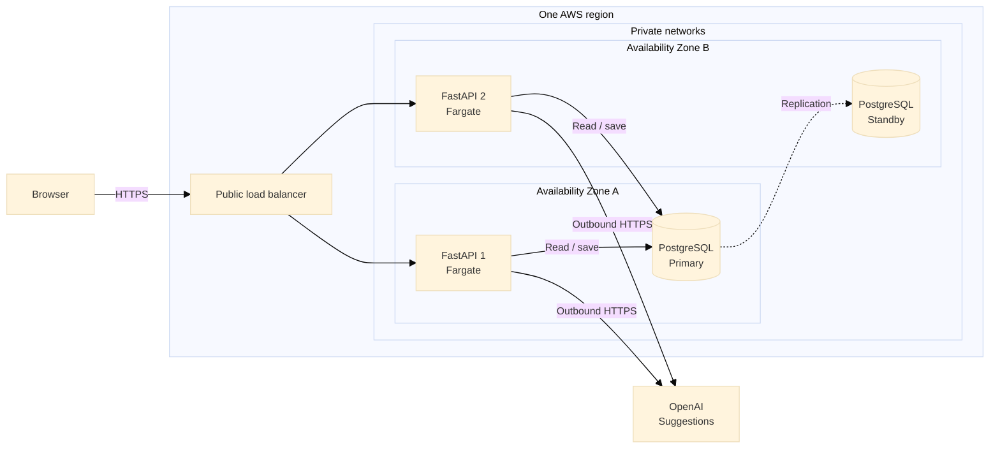

# Margin — production infrastructure proposal

*By: Mira Mohan · September 27, 2026*

**Proposed, not deployed.** Designed for a small customer base handling private documents.

## 1. Architecture & storage

Run the app in containers (code and dependencies packaged together) using [ECS/Fargate](https://docs.aws.amazon.com/AmazonECS/latest/developerguide/AWS_Fargate.html). Keep the app and RDS PostgreSQL database private. Store documents and versions in PostgreSQL; skip caching initially to avoid stale copies.

Only selected text and the instruction go to OpenAI. Outbound routing, login, and monitoring are omitted for clarity.

**Example flows:**

- **Manual:** Select a match → type replacement wording → review → Save.
- **AI-assisted:** Select a match → enter an instruction → request a suggestion → review or edit → Save. Suggestions alone do not change the document.

**Shared save flow:** The load balancer routes to a healthy app copy. A database transaction validates the target and version before saving; the app returns the updated document. A stale version returns 409 without saving.

## 2. CI/CD & deployment

GitHub Actions runs tests, lint, and security checks, then stores the packaged app in ECR, AWS's container registry, using temporary AWS credentials. Test in staging, approve, then replace production copies gradually. Enable health checks and rollback for failed deployments. Keep database changes compatible with the previous app version.

## 3. Security & compliance

Use Cognito for company single sign-on; check organization and document permissions on every request. Encrypt connections, stored data, and backups. Keep credentials in Secrets Manager. Audit who changed which document and when. Define retention, export/deletion (including backup expiry), access reviews, and incident response. Review AI provider data handling before sending customer text. These controls support GDPR/SOC 2 work, not a claim of compliance.

## 4. Scaling & resilience

Run two app copies in separate Availability Zones (locations within one region). Add copies as traffic grows, limiting app count and database connections. Use an RDS Multi-AZ standby for failover, plus backups and tested restores. Agree acceptable downtime and data loss with customers. Preserve manual editing during AI outages. Keep edits immediate; reserve queues or batching for future long-running work.

## 5. Monitoring & observability

Use CloudWatch for logs, metrics, and alerts. Track response times, errors, conflicts, database capacity, and AI failures/usage. Trace requests across the app, database, and AI calls. Alert on sustained errors, unavailable app copies, or low remaining database capacity. Exclude document text, prompts, search terms, and secrets from logs and traces.

## 6. Operations & cost

Size the app and database using load tests and actual usage. Limit AI usage per customer; set budget alerts and log retention. Include load balancing, standby, backup, and outbound networking costs. Managed services and spare capacity cost more but reduce maintenance and downtime. Start in one region meeting customer residency needs; add another only when recovery needs justify the cost and complexity.
